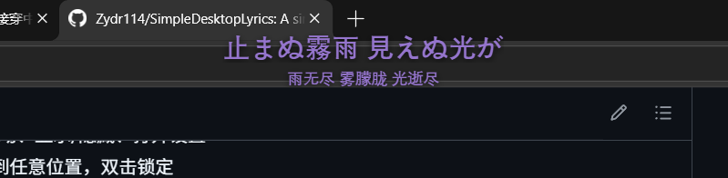
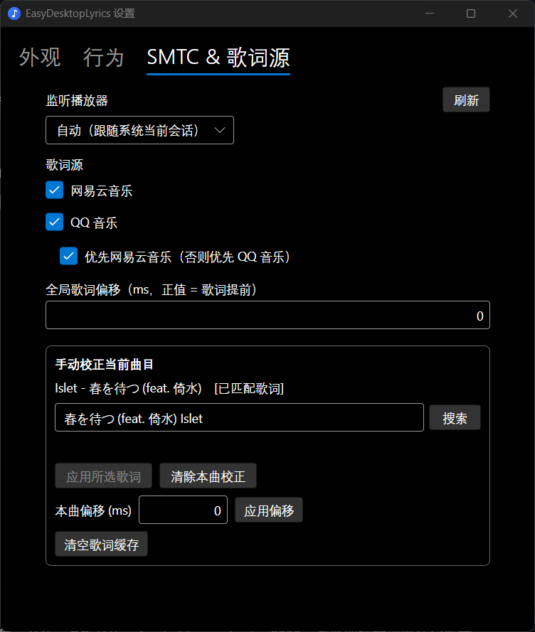

# SimpleDesktopLyrics

极简 Windows 桌面歌词——通过 [SMTC](https://learn.microsoft.com/windows/uwp/audio-video-camera/system-media-transport-controls) 与任意播放器同步，悬浮于桌面所有窗口之上，鼠标穿透（待实现）、不打扰正常使用。


## 截图




## 功能

| 功能 | 说明 |
|------|------|
| **SMTC 同步** | 自动检测 Spotify、网易云音乐、QQ 音乐、Apple Music、foobar2000、浏览器播放器等任何发布 SMTC 的程序 |
| **自动匹配歌词** | 从网易云音乐 / QQ 音乐公开接口搜索并匹配 LRC 歌词，本地缓存永久有效 |
| **桌面悬浮** | 歌词置顶于所有窗口、鼠标完全穿透、不抢焦点、不出现在 Alt+Tab 和任务栏 |
| **描边 & 阴影** | 8 方向偏移文字描边 + 投影，保证任意桌面背景下可读 |
| **翻译行** | 支持网易云 tlyric 翻译，可独立调整字号和行间距 |
| **全光谱色板** | 内置 100 色 PS 式色板，一键选取歌词颜色 |
| **位置预设** | 九宫格快捷定位 + 水平/垂直百分比滑块，覆盖屏幕任意位置 |
| **手动校正** | 自动匹配失败时可手动搜索指定歌词，支持单曲偏移 |
| **极轻量** | 唯一第三方依赖为 Avalonia，**单 exe 无需任何额外文件**，约 21MB，空闲 CPU ≈ 0% |

## 使用

1. 下载最新 [Release](https://github.com/Zydr114/SimpleDesktopLyrics/releases) 中的 `EasyDesktopLyrics.exe`，放到任意目录双击运行
2. 运行 `EasyDesktopLyrics.exe`
3. 打开任意音乐播放器开始播放，歌词自动出现
4. 右下角托盘图标：**锁定/解锁拖动** · **显示/隐藏** · **设置** · **退出**
5. 解锁状态下可拖动歌词窗口，双击托盘菜单"锁定歌词位置"恢复

## 设置项

### 外观

| 设置 | 说明 |
|------|------|
| 字体 | 从系统已安装字体中选择，下方实时预览 |
| 正文字号 | 歌词正文的字体大小（DIP），直接输入数值 |
| 字重 | 常规(400) / 中等(500) / 半粗(600) / 粗体(700) |
| 翻译字号 | 翻译行的字体大小，设为 0 时自动取正文字号的 60% |
| 行间距 | 正文与翻译行之间的间距（DIP） |
| 文字颜色 | 正文与翻译的文字颜色，支持 hex 直输、6 个快捷色块、100 色全光谱色板 |
| 文字阴影 | 开启后文字带投影，增强可读性 |
| 文字描边 | 开启后在文字周围叠加 8 方向偏移层，可独立设置描边颜色（含预览框）和宽度（1–8px 滑块） |
| 不透明度 | 歌词整体透明度（10%–100% 滑块） |
| 最大宽度 | 歌词行最大宽度（DIP），超宽自动等比缩小 |
| 位置预设 | 九宫格下拉快捷定位：左上/中上/右上/左中/居中/右中/左下/中下/右下/自定义 |
| 水平 / 垂直 | 百分比滑块（5%–95%），用于自定义位置的精细调节 |

### 行为

| 设置 | 说明 |
|------|------|
| 显示翻译行 | 实时开关翻译显示 |
| 对齐方式 | 歌词对齐方式：居中 / 左对齐 / 右对齐 |
| 暂停时隐藏 | 播放暂停时自动隐藏歌词窗口 |
| 无歌词时显示曲目标题 | 未匹配到歌词时显示"艺术家 - 标题"作为替代 |
| 开机自启 | 通过注册表 HKCU Run 键实现 |

### SMTC & 歌词源

| 设置 | 说明 |
|------|------|
| 监听播放器 | 选择自动跟随系统当前会话，或锁定某个播放器（避免浏览器等干扰） |
| 歌词源 | 单独开关网易云音乐 / QQ 音乐，可调整优先级（前者优先或后者优先） |
| 全局歌词偏移 | 全局时间偏移（毫秒），正值 = 歌词提前显示 |
| 手动校正 | 对当前曲目手动搜索歌词并指定，支持单曲偏移校正 |

## 构建

```powershell
# 需要 .NET 10 SDK
git clone https://github.com/Zydr114/SimpleDesktopLyrics.git
cd SimpleDesktopLyrics

# Debug 运行
dotnet run

# 自包含发布
dotnet publish -c Release -r win-x64 --self-contained true `
  -p:PublishSingleFile=true -p:EnableCompressionInSingleFile=true `
  -p:PublishTrimmed=true -p:TrimMode=partial

# 产物为单个 EasyDesktopLyrics.exe，无需任何额外文件即可分发
# bin\Release\net10.0-windows10.0.19041.0\win-x64\publish\
```

```powershell
# 调试命令
.\EasyDesktopLyrics.exe --probe "歌名" "歌手"   # 测试歌词搜索
.\EasyDesktopLyrics.exe --probe-smtc             # 测试 SMTC 会话
```

## 技术栈

| 组件 | 选型 | 说明 |
|------|------|------|
| 运行时 | .NET 10 | net10.0-windows10.0.19041.0（LTS） |
| UI 框架 | Avalonia 12.1 | FluentTheme，手写 MVVM，零框架 |
| SMTC | `Windows.Media.Control` | WinRT 投影，Windows SDK 自带，无额外包 |
| HTTP | `HttpClient`（单例） | 8s 超时，gzip 自动解压 |
| JSON | `System.Text.Json` | 源生成（`JsonSerializerContext`），裁剪安全 |
| 存储 | `%AppData%\EasyDesktopLyrics\` | settings.json / overrides.json / cache/ |
| 穿透 | `WS_EX_TRANSPARENT` | P/Invoke，与 Avalonia DirectComposition 兼容 |

## 许可

MIT
